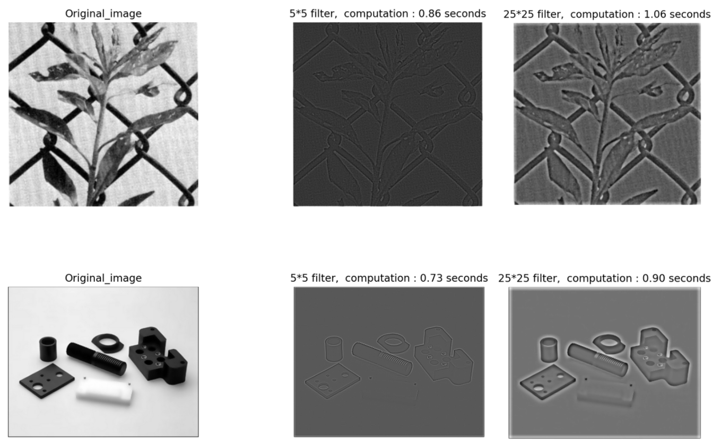

# PyQt5-Image-Processing-GUI-HW3

This is an image processing application developed using PyQt5 and OpenCV, designed for various image manipulation and filtering operations, including high-pass filtering, LOG filtering with Sobel edge detection, zero-crossing thresholding, and local enhancement. The user interface allows users to interact with the application and visualize the results of the applied image filters.

## Features

- **Open Image**: Load an image file (JPEG, PNG, etc.) from your system.
- **High-Pass Filter**: Apply a high-pass filter to the image with customizable filter size.
- 
- **LOG Sobel Filter**: Apply the LOG (Laplacian of Gaussian) filter followed by Sobel edge detection. The user can adjust the filter size.
- 
- **Zero Crossing Threshold**: Detect zero crossings in the filtered image and apply different thresholds to visualize edge detection.
- 
- **Local Enhancement**: Perform local histogram equalization for improving image contrast and details in specific areas.
-  

## Requirements

- Python 3.x
- PyQt5
- OpenCV
- NumPy
- Matplotlib

To install the required libraries, you can use `pip`:

```bash
pip install PyQt5 opencv-python numpy matplotlib
```

## How to Use

1. **Open Image**: Click the "開啟圖片" (Open Image) button to load an image file.
2. **High-Pass Filter**: Enter a filter size in the "filter_size" text field and click the "完成" (Complete) button to apply the high-pass filter.
3. **LOG Sobel Filter**: Enter the filter size in the "LOG_filter_size" text field and click the "完成" (Complete) button to apply the LOG and Sobel filters.
4. **Zero Crossing Threshold**: Click the "zero crossing threshold" button to perform thresholding on the filtered image and visualize edge detection.
5. **Local Enhancement**: Click the "局部強化" (Local Enhancement) button to apply local histogram equalization for image enhancement.

## Interface Elements

- **Open Image Button**: Opens the file dialog to select an image.
- **Filter Size Input**: Input field to enter the filter size for the high-pass and LOG filters.
- **Complete Button**: Apply the selected filter with the entered filter size.
- **Zero Crossing Threshold Button**: Apply zero crossing thresholding and display the result.
- **Local Enhancement Button**: Apply local histogram equalization for local image enhancement.

## Example Workflow

1. Click "開啟圖片" (Open Image) to load an image.
2. Set a filter size and click "完成" (Complete) to apply the high-pass filter.
3. Adjust the filter size for the LOG filter and Sobel edge detection and click "完成".
4. Click "zero crossing threshold" to apply edge detection and display the results with two different thresholds.
5. Apply local enhancement by clicking "局部強化" (Local Enhancement).
